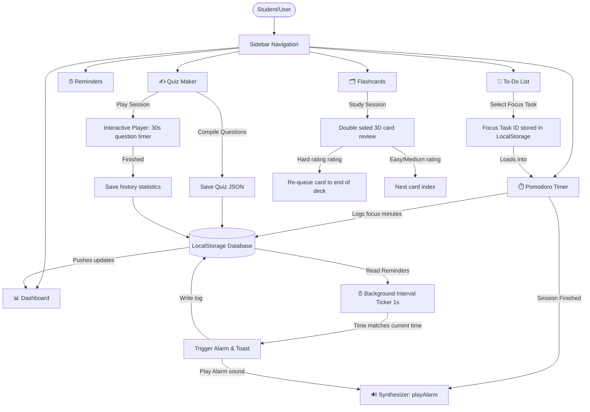

# 🎓 Sarthi StudyMate

Sarthi StudyMate is a premium, glassmorphic Study Planner web application designed to optimize student focus, task organization, and learning retention. Built with vanilla HTML5, modern CSS3 (with theme triggers), and ES modules.

🔗 **GitHub Repository:** [https://github.com/RAHULKALEtech/sarthi-studymate](https://github.com/RAHULKALEtech/sarthi-studymate)

---

## 🗺️ Application Architecture & Navigation Flow

The application runs as a **Single Page Application (SPA)** with a persistent sidebar and module-based section routing. Below is the workflow diagram showing how modules integrate and synchronize via LocalStorage and the global Event Hub:



---

## ⚙️ Core Workflows

### 1. The Focus Loop (To-Do & Pomodoro Integration)
1.  **Add Task:** The student adds homework or reading tasks in the **To-Do List** specifying category (e.g., Math, Science) and priority (High, Medium, Low).
2.  **Focus Selection:** Clicking the "Set as Focus" button on any task binds its ID globally as today's target.
3.  **Study Sessions:** In **Pomodoro**, the timer displays the focus task title. Starting the timer fires the ticking countdown.
4.  **Completed session:** When the timer reaches zero, a synthesized alert rings. Focus minutes are logged, and the dashboard statistics update automatically.

### 2. The Background Scheduler (Reminders)
1.  **Create Alert:** The student schedules an exam prep alert or a homework deadline.
2.  **Background Checker:** A thread-like `setInterval` ticker in `reminders.js` checks the system time against scheduled events every second.
3.  **Alarm Trigger:** If the scheduled time is reached, a rhythmic chime rings using the Web Audio API, and an active toast alert is rendered. If it is repeating (daily/weekly), it automatically schedules the next occurrence.

### 3. The Active Recall (Quiz Maker & Interactive Player)
1.  **Quiz Setup:** Create custom quizzes dynamically or import them via a standardized JSON format.
2.  **Question Taker:** The interactive player loads the questions. The student has a 30-second ticking window to respond to each multiple-choice question.
3.  **Visual feedback:** Clicking an option locks choices. Correct selections flash green; wrong answers flash red while highlighting the correct choice.
4.  **Results Ring:** A final circular SVG percentage ring animates your total score and archives it into your study history logs.

### 4. The Spaced Repetition (Flashcard Decks)
1.  **Active Recall Flip:** Review decks of cards by tapping the 3D-card. It rotates 180 degrees using CSS 3D perspectives.
2.  **Spaced Rating:** 
    *   **Easy / Medium:** Advanced to the next card.
    *   **Hard:** The card is immediately moved to the end of the review stack, forcing the student to review it again at the end of the session.

---

## 📖 Detailed Guide & Manual Verification Steps

### 1. Running the Local Environment
Execute the lightweight static server on your computer:
```bash
npm run dev
# or
node server.js
```
Now, open your browser to **[http://localhost:3000](http://localhost:3000)**.

### 2. Styling Preferences & Theme Changing
*   Click the **Theme Toggle** button in the sidebar footer.
*   **Verification:** The entire body shifts from deep navy (`#0b0f19`) to soft slate-white (`#f3f4f6`) with a smooth 0.3-second cubic-bezier transition. Glassmorphism overlays switch transparency and contrast levels.

### 3. Managing To-Do Tasks
*   Click **Add Task**, fill out the fields (e.g. Title: "Solve Calculus assignment", Category: "Math", Priority: "High"), and save.
*   Click the check-box circle to mark it complete.
*   **Verification:** Completed tasks slide to the right column, text gets crossed out, and the dashboard progress bar updates.

### 4. Timer Verification
*   Go to **Pomodoro**. In settings, set **Focus Duration** to `1` minute to test. Click **Save Configurations**.
*   Select the focus task from the dropdown.
*   Click **Start**. 
*   **Verification:** The SVG stroke ring (`stroke-dashoffset`) will smoothly recede from full circle (628px) down to 0. At 0, the browser synthesizes three double-beeps (880Hz tones).

### 5. Quiz Maker Testing (Preloaded 10-Question Exam)
*   Go to **Quiz Maker**. Click **Take Quiz** on the preloaded "Web Technology Essentials" card.
*   **Verification:** 
    *   Check that exactly 10 questions are loaded.
    *   Observe the 30-second ticking clock on the top right.
    *   Click a wrong answer: verify it turns red, the correct option turns green, and an alarm beep plays.
    *   Complete all 10 questions and verify the green scoring ring animates to show your percentage.

### 6. 3D Flashcard Flips
*   Go to **Flashcards** and click **Study** on the preloaded "General Science Terminology" deck.
*   Click on the card.
*   **Verification:** Verify the card rotates around the Y-axis smoothly. Ratings (Easy, Medium, Hard) will slide into view. Click "Hard" and verify that card is re-added to the end of the study session.

---

## 🛠️ Technology Stack & Custom Engines
1.  **Core Frontend:** Vanilla HTML5, modern flexbox/grid layout, and ES6 JavaScript Modules.
2.  **Sound Synthesis (Web Audio API):**
    No external media files (which can cause slow loading or CORS errors). Sounds are generated dynamically:
    *   *Chimes (Success):* Programmed as a C major arpeggio note progression (C5 -> E5 -> G5 -> C6).
    *   *Alarms (Warning/Fail):* Rhythmic double-beeps at 880Hz.
3.  **3D CSS Engine:**
    Calculated using CSS `perspective: 1200px` and card faces styled with `backface-visibility: hidden` to allow double-sided card renders.
4.  **Local Storage Engine:**
    Uses namespace prefix `sarthi_studymate_*` to keep stored arrays organized and separate from other projects.
